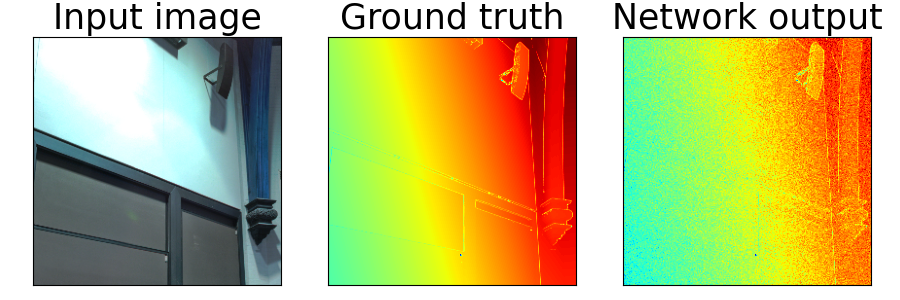
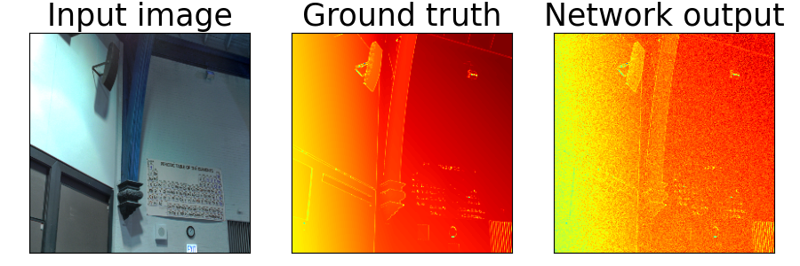
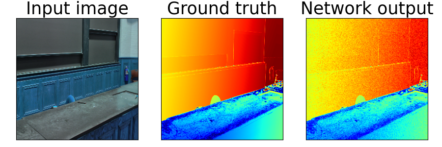

# MonoDepth

Monocular depth estimation using a deep neural network model with PyTorch. 

### Method

Neural network model based on [UNET](https://arxiv.org/abs/1505.04597) architecture with added Batch normalization layers. Model is trained on [DIODE](https://diode-dataset.org/) dataset based on the following loss contributions:

#### Structural Similarity Index (SSIM)

$C_{SSIM}^l=\frac{1}{N} \sum_{i, j} \frac{1-\operatorname{SSIM}\left(I_{i j}^l \tilde{I}_{i j}^l\right)}{2}$

SSIM is used as a metric to measure the similarity between two given images.

#### L1 Loss

$C_{L1}^l = \sum_{i, j} |y_{pred} - y_{true}|$

Again, used to measure the similarity between the ground truth depth map and the network's prediction

#### Disparity Smoothness

$C_{d s}^l=\frac{1}{N} \sum_{i, j}\left|\partial_x d_{i j}^l\right| e^{-\left\|\partial_x I_{i j}^l\right\|}+\left|\partial_y d_{i j}^l\right| e^{-\left\|\partial_y I_{i j}^l\right\|}$

The disparity smoothness loss ensures that the predicted disparities maintain piecewise smoothness and eliminate discontinuities wherever possible.

The network is trained using a weighted combination of all three error terms.

### Results

